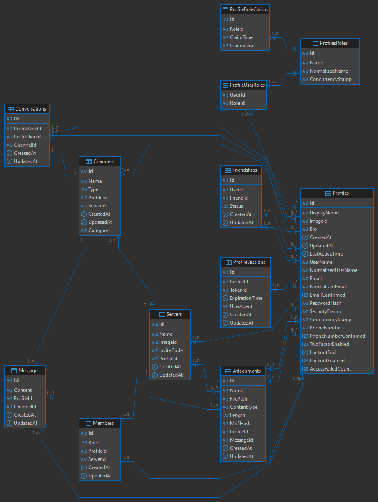

# ChatApp

> [!WARNING]  
> This software requires you to have **.NET 6.0 or later** and **Node.js** installed on your system.  
>  
> This project is for training purposes.

---

## **Database Diagram**

---


## Building

To build the application from source, follow these steps:

### **1. Clone the Repository**
```sh
git clone --depth 1 --filter=blob:none --sparse https://github.com/amrshaheen20/JUNK.git
cd JUNK
git sparse-checkout set Web/ChatApp
```
### **2. Edit Appsettings.json**
Go to "ChatApp.server/appsettings.json and edit it

### **3. Run app**
use "Run.bat" to run this app


